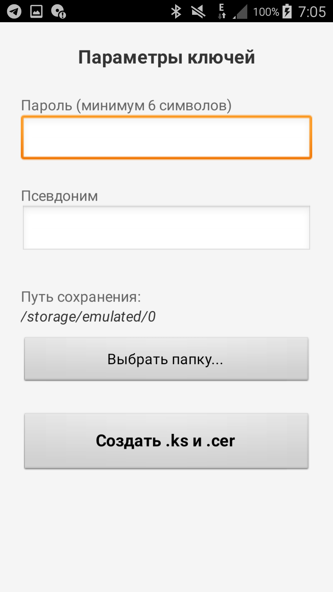
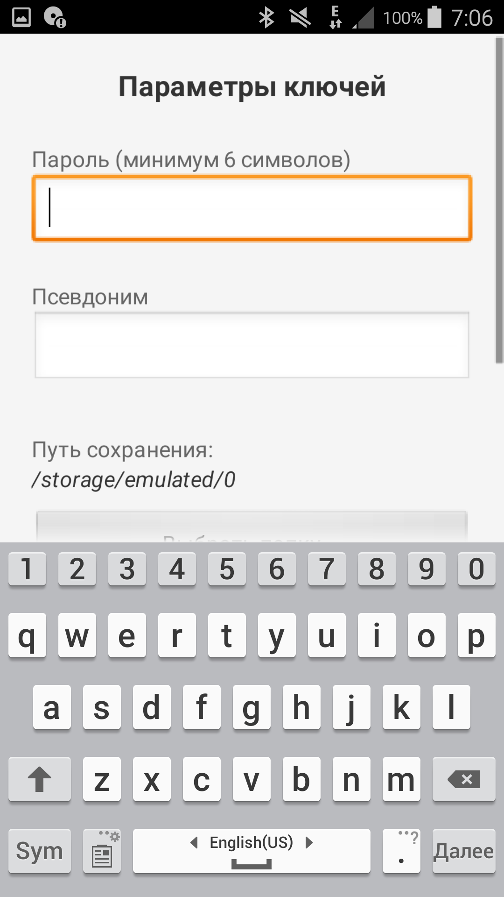
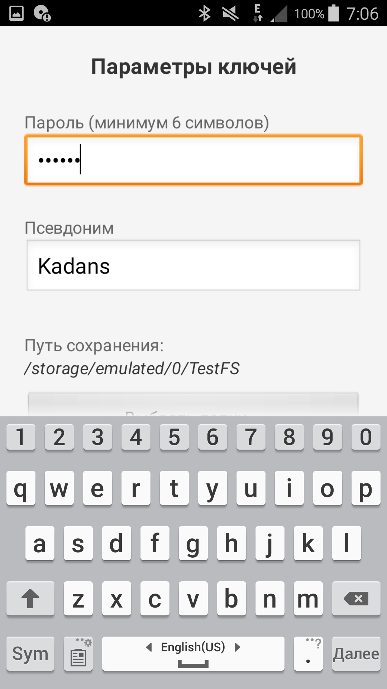
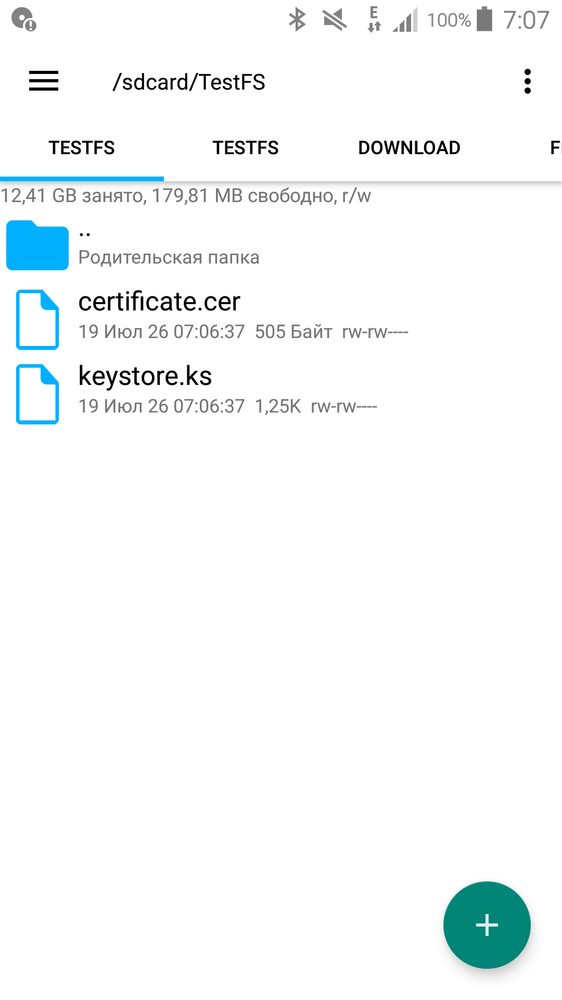

# J2ME-Key-Generator
(Приложение создано при помощи ИИ) Приложение для создания сертификата (.cer) и хранилище ключей Java Keystore (.ks) для платформы J2ME .
Файл .ks нужен для подписей .jad файлов через утилиту JadTool, файл .cer помещяется в ФС телефона чтобы подписанное приложение .jar ему доверяло.
 Аналог ПК утилиты KeyTool (входит в состав JDK)
## Инструкция:
1. С помощью специальных программ для прошивки телефонов Sony Ericsson зайдите в файловую систему телефона по пути: /tpa/preset/system/ams/certificates/
2. Скопируйте туда ваш файл .cer
3. Перезагрузите телефон
* После этого устройство будет доверять  .ks файлу, и подписанные им игры перестанут выдавать любые запросы на доступ к файлам (JSR75) или сети.
 
 
 
 

